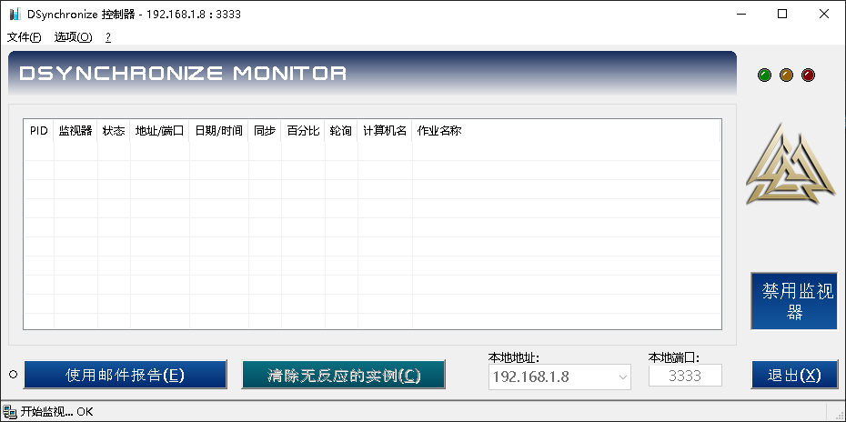

### [Dev-Sidecar](https://github.com/docmirror/dev-sidecar)	
??? Example "Dev-Sidecar"
	开发者边车，github打不开，github加速，git clone加速，git release下载加速，stackoverflow加速
    === "截图"
        { width="200" align=left }
    === "下载"
         @github-releases[docmirror/dev-sidecar]

---

### [DSynchronize 同步](http://dimio.altervista.org)
??? Example "DSynchronize 同步"
    DSynchronize 允许您每天保存数据，保护其免受病毒和硬盘故障的侵害。
    同步通常需要一些时间，并且可以自动执行。
    要同步的数据可以位于硬盘、软盘、LAN、USB 密钥、CD-DVD（通过数据包写入）和 FTP 服务器上。
    它是独立的，也就是不需要安装，只需打开 zip 并运行即可。
    === "截图"
        { width="200" align=left }
        { width="358" align=left }
    === "下载"
        * [DSynchronize.zip](download/DSynchronize.zip)

---

