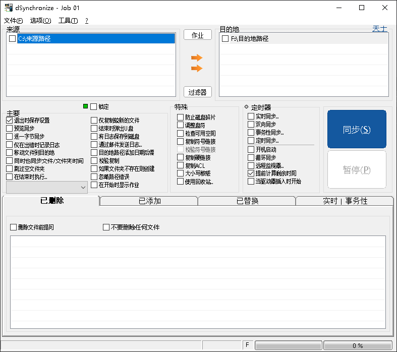

### [DSynchronize](http://dimio.altervista.org)
??? Example "DSynchronize"
	DSynchronize 允许您每天保存数据，保护其免受病毒和硬盘故障的侵害。
	同步通常需要一些时间，并且可以自动执行。
	要同步的数据可以位于硬盘、软盘、LAN、USB 密钥、CD-DVD（通过数据包写入）和 FTP 服务器上。
	它是独立的，也就是不需要安装，只需打开 zip 并运行即可。
	=== "截图"
		{ width="150" align=left loading=lazy } 
		{ width="268" align=left loading=lazy } 
	=== "下载"
		* [DSynchronize.zip](download/DSynchronize.zip)
---

###

