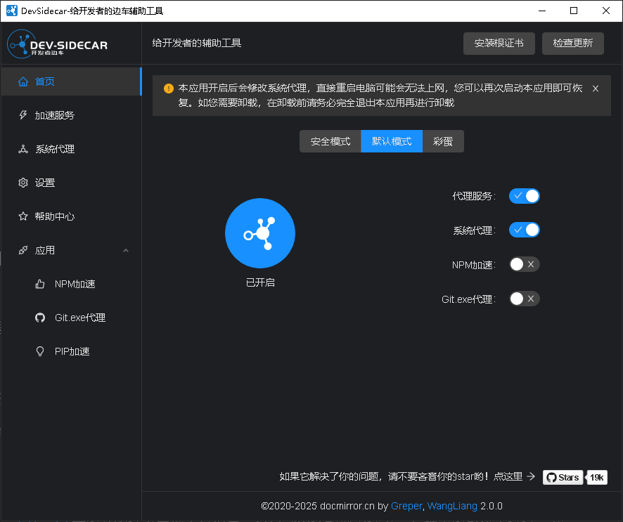

---

### [Dev-Sidecar](https://github.com/docmirror/dev-sidecar){ .md-button } 	[下载 Win 64位](https://ghfast.top/github.com/docmirror/dev-sidecar/releases/download/v2.0.0/DevSidecar-2.0.0-windows-x64.exe){ .md-button }

{ width="300" align=left loading=lazy } 开发者边车，命名取自service-mesh的service-sidecar，意为为开发者打辅助的边车工具（以下简称ds） 通过本地代理的方式将https请求代理到一些国内的加速通道上。
开发者边车，github打不开，github加速，git clone加速，git release下载加速，stackoverflow加速 

